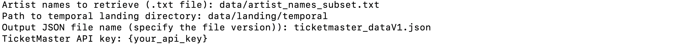

# ADSDB <a href="https://github.com/evamartin1240/ADSDB"></a> <a href="https://github.com/evamartin1240/ADSDB"></a>

### Step 1: Data Ingestion

<div style="text-align: justify;">
When running the data ingestion scripts, for both TicketMaster and Spotify source, it will prompt you for specific input details. You will be asked to provide the path to the input .txt file containing artist names, the path to the temporal directory where the output JSON file will be stored, the name of the output JSON file including a version number, and your TicketMaster/Spotify API key. Once all inputs are provided, the script will save the data and confirm the location of the saved JSON file.
</div>

```bash
$ python scripts/landing/ticketmaster_data_ingestion.py
```




