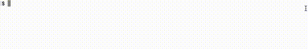

# ADSDB <a href="https://github.com/evamartin1240/ADSDB"></a> <a href="https://github.com/evamartin1240/ADSDB"></a>

## Step 1: Data Ingestion

When running the data ingestion scripts for both TicketMaster and Spotify sources,
you will be prompted for specific input details. You will need to provide the
following:

1. The path to the input `.txt` file containing artist names
2. The path to the temporal directory where the output `.json` file will be stored
3. The name of the output `.json` file including a version number
4. Your TicketMaster/Spotify API key.

Once all inputs are provided, the script will save the data and confirm the
location of the saved JSON file.

**TicketMaster:**

```bash
$ python scripts/landing/ticketmaster_data_ingestion.py
```



