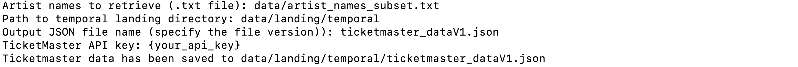

# ADSDB <a href="https://github.com/evamartin1240/ADSDB"></a> <a href="https://github.com/evamartin1240/ADSDB"></a>

### Step 1: Data Ingestion

```bash
$ python /landing/ticketmaster_data_ingestion.py
```

<a href="https://github.com/evamartin1240/ADSDB"></a>

After executing the command, the script will prompt you for specific input details. You will be asked to provide the path to the input .txt file containing artist names (e.g., /data/artist_names_subset.txt), the path to the temporal directory where the output JSON file will be stored (e.g., /landing/temporal), the name of the output JSON file including a version number (e.g., ticketmaster_dataV1.json), and your TicketMaster API key. Once all inputs are provided, the script will save the data and confirm the location of the saved JSON file (e.g., /landing/temporal/ticketmaster_dataV1.json).

Ticketmaster data has been saved to /landing/temporal/ticketmaster_dataV1.json


